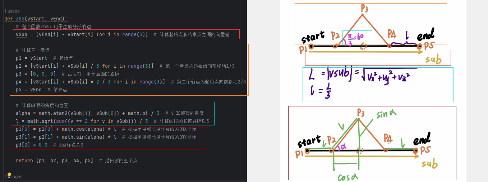
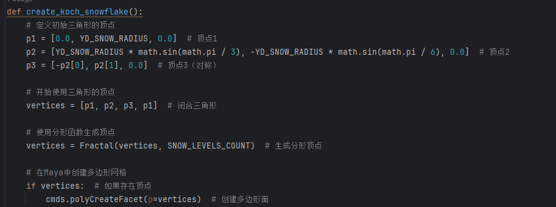
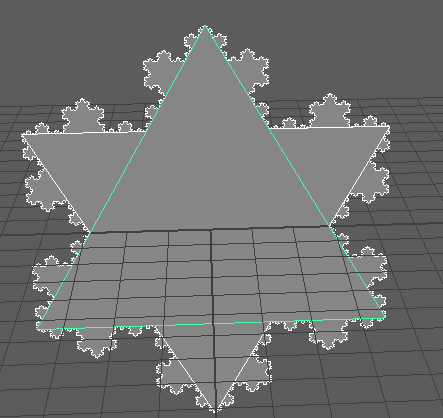
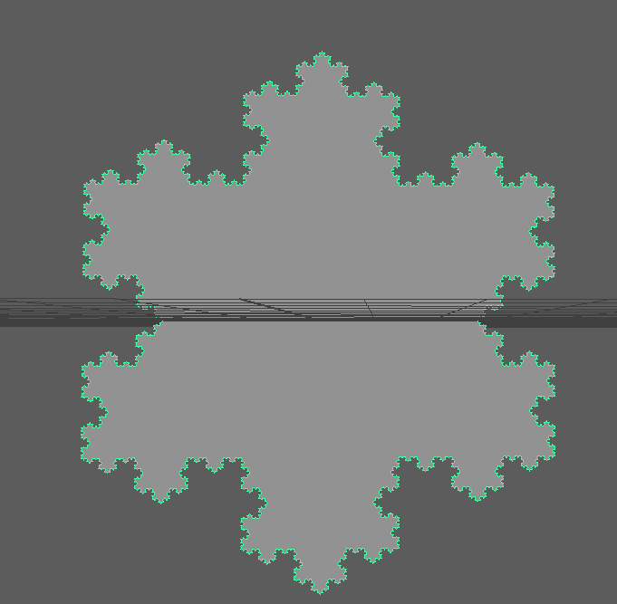
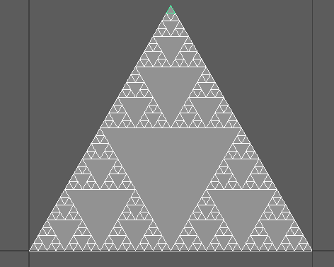

# maya插件入门 分形


# [分形之科赫(Koch)雪花](https://www.cnblogs.com/WhyEngine/p/3981674.html)


https://www.cnblogs.com/WhyEngine/p/3995941.html

https://www.cnblogs.com/WhyEngine/p/3981674.html

C++：

   科赫曲线是一种分形。其形态似雪花，又称科赫雪花、雪花曲线.瑞典人科赫于1904年提出了著名的“雪花”曲线，这种曲线的作法是，从一个正三角形开始，把每条边分成三等份，然后以各边的中间长度为底边。分别向外作正三角形，再把“底边”线段抹掉，这样就得到一个六角形，它共有12条边。再把每条边三等份，以各中间部分的长度为底边，向外作正三角形后，抹掉底边线段。反复进行这一过程，就会得到一个“雪花”样子的曲线。这曲线叫做科赫曲线或雪花曲线。

   给定线段AB，科赫曲线可以由以下步骤生成：
   (1)将线段分成三等份（AC,CD,DB）
   (2)以CD为底，向外（内外随意）画一个等边三角形DMC
   (3)将线段CD移去
   (4)分别对AC,CM,MD,DB重复1~3。
   反复进行这一作图过程，得到的曲线越来越精细。

　　科赫曲线有着极不寻常的特性，不但它的周长为无限大，而且曲线上任两点之间的距离也是无限大。该曲线长度无限，却包围着有限的面积。很神奇的一个曲线，他说明了一个悖论：“无限长度包围着有限面积。”

   程序中实现了0~8级的科赫雪花分形.程序设计时,将这9级曲线的顶点数据全部放置在一个内存中.并使用如下结构体进行设置:

```C++
    struct SnowLevel
    {
        Yuint vertexStart;
        Yuint verticesCount;
    };
    SnowLevel m_snowLevels[SNOW_LEVELS_COUNT];
    Yuint m_currentLevel;
```


   分形图形的顶点生成算法代码如下:

```C++
static void Zhe(const Vector3& vStart, const Vector3& vEnd, Vector3* pVertices)
{
    Vector3 vSub = vEnd - vStart;

    pVertices[0] = vStart;
    pVertices[1] = vStart + vSub/3;
    pVertices[3] = vStart + vSub*2/3;
    pVertices[4] = vEnd;

    Yreal alfa = atan2f(vSub.y, vSub.x);
    alfa += YD_REAL_PI/3;

    Yreal l = D3DXVec3Length(&vSub)/3;
    pVertices[2].x = pVertices[1].x + cosf(alfa)*l;
    pVertices[2].y = pVertices[1].y + sinf(alfa)*l;
    pVertices[2].z = 0.0f;
}

void        CFractalSnowEntity::Fractal(Vector3* pVertices)
{
    pVertices[0].x = 0.0f;
    pVertices[0].y = YD_SNOW_RADIUS;
    pVertices[0].z = 0.0f;

    pVertices[1].x = YD_SNOW_RADIUS*sinf(YD_REAL_PI/3);
    pVertices[1].y = -YD_SNOW_RADIUS*sinf(YD_REAL_PI/6);
    pVertices[1].z = 0.0f;

    pVertices[2].x = -pVertices[1].x;
    pVertices[2].y = pVertices[1].y;
    pVertices[2].z = 0.0f;

    for (Yuint i = 1; i < SNOW_LEVELS_COUNT; i++)
    {
        const Vector3* pSrc = pVertices + m_snowLevels[i - 1].vertexStart;
        Vector3* pDest = pVertices + m_snowLevels[i].vertexStart;

        Yuint c = m_snowLevels[i - 1].verticesCount;

        for (Yuint j = 0; j < c; j++)
        {
            Zhe(pSrc[j], pSrc[(j + 1)%c], pDest);
            pDest += 4;
        }
    }
}
```


#### maya

```python
import maya.cmds as cmds
import math

# 定义常量
SNOW_LEVELS_COUNT = 5  # 可以根据需要更改此值
YD_SNOW_RADIUS = 5.0


def Zhe(vStart, vEnd):
    vSub = [vEnd[i] - vStart[i] for i in range(3)]

    # Calculate the three new points
    p1 = vStart
    p2 = [vStart[i] + vSub[i] / 3 for i in range(3)]
    p3 = [0, 0, 0]  # Placeholder for peak
    p4 = [vStart[i] + vSub[i] * 2 / 3 for i in range(3)]
    p5 = vEnd

    # Calculate the angle and position of the peak
    alpha = math.atan2(vSub[1], vSub[0]) + math.pi / 3
    l = math.sqrt(sum((v ** 2 for v in vSub))) / 3
    p3[0] = p2[0] + math.cos(alpha) * l
    p3[1] = p2[1] + math.sin(alpha) * l
    p3[2] = 0.0

    return [p1, p2, p3, p4, p5]


def Fractal(vertices, level):
    if level == 0:
        # Base case: just add the original line segment
        return vertices

    # Get current vertices
    current_vertices = []

    # Process each pair of vertices
    for i in range(len(vertices) - 1):
        start = vertices[i]
        end = vertices[i + 1]

        # Generate segments from start to end
        segments = Zhe(start, end)
        current_vertices.extend(segments[:-1])  # Don't add the last point to avoid duplicating

    current_vertices.append(vertices[-1])  # Add the final point

    # Recur to the next level
    return Fractal(current_vertices, level - 1)


def create_koch_snowflake():
    # Define initial triangle vertices
    p1 = [0.0, YD_SNOW_RADIUS, 0.0]
    p2 = [YD_SNOW_RADIUS * math.sin(math.pi / 3), -YD_SNOW_RADIUS * math.sin(math.pi / 6), 0.0]
    p3 = [-p2[0], p2[1], 0.0]

    # Start with the triangle's vertices
    vertices = [p1, p2, p3, p1]  # Closing the triangle

    # Generate vertices using the fractal function
    vertices = Fractal(vertices, SNOW_LEVELS_COUNT)

    # Create a polygon mesh in Maya
    if vertices:
        cmds.polyCreateFacet(p=vertices)


# Execute the function to create the Koch snowflake
create_koch_snowflake()

```

##### 1、生成边部分





##### 2、main部分









总的代码：

```python
# ------------------- 代码实现 -------------------
import maya.cmds as cmds  # 导入Maya命令模块
import math  # 导入数学模块

# 定义常量
SNOW_LEVELS_COUNT = 0  # 可以根据需要更改此值，分形的层数
YD_SNOW_RADIUS = 5.0  # 雪花的半径

def Zhe(vStart, vEnd):
    # 定义函数Zhe，用于生成分形的边
    vSub = [vEnd[i] - vStart[i] for i in range(3)]  # 计算起始点和结束点之间的向量差

    # 计算三个新点
    p1 = vStart  # 起始点
    p2 = [vStart[i] + vSub[i] / 3 for i in range(3)]  # 第一个新点为起始点向前移动1/3
    p3 = [0, 0, 0]  # 占位符，用于后面的峰顶
    p4 = [vStart[i] + vSub[i] * 2 / 3 for i in range(3)]  # 第二个新点为起始点向前移动2/3
    p5 = vEnd  # 结束点

    # 计算峰顶的角度和位置
    alpha = math.atan2(vSub[1], vSub[0]) + math.pi / 3  # 计算峰顶的角度
    l = math.sqrt(sum((v ** 2 for v in vSub))) / 3  # 计算线段的长度并除以3
    p3[0] = p2[0] + math.cos(alpha) * l  # 根据角度和长度计算峰顶的X坐标
    p3[1] = p2[1] + math.sin(alpha) * l  # 根据角度和长度计算峰顶的Y坐标
    p3[2] = 0.0  # Z坐标设为0

    return [p1, p2, p3, p4, p5]  # 返回新的五个点

def Fractal(vertices, level):
    # 定义递归函数生成分形
    if level == 0:
        # 基本情况：仅添加原始线段
        return vertices

    # 获取当前顶点
    current_vertices = []  # 存储当前顶点列表

    # 处理每一对顶点
    for i in range(len(vertices) - 1):  # 遍历所有顶点对
        start = vertices[i]  # 当前起始点
        end = vertices[i + 1]  # 当前结束点

        # 从起始点到结束点生成段
        segments = Zhe(start, end)  # 调用Zhe函数生成新段
        current_vertices.extend(segments[:-1])  # 将生成的段添加到当前顶点列表中，不添加最后一个点以避免重复

    current_vertices.append(vertices[-1])  # 添加最后一个顶点

    # 递归到下一个层级
    return Fractal(current_vertices, level - 1)  # 继续递归调用

def create_koch_snowflake():
    # 定义初始三角形的顶点
    p1 = [0.0, YD_SNOW_RADIUS, 0.0]  # 顶点1
    p2 = [YD_SNOW_RADIUS * math.sin(math.pi / 3), -YD_SNOW_RADIUS * math.sin(math.pi / 6), 0.0]  # 顶点2
    p3 = [-p2[0], p2[1], 0.0]  # 顶点3（对称）

    # 开始使用三角形的顶点
    vertices = [p1, p2, p3, p1]  # 闭合三角形

    # 使用分形函数生成顶点
    vertices = Fractal(vertices, SNOW_LEVELS_COUNT)  # 生成分形顶点

    # 在Maya中创建多边形网格
    if vertices:  # 如果存在顶点
        cmds.polyCreateFacet(p=vertices)  # 创建多边形面

# 执行函数以创建科赫雪花
create_koch_snowflake()  # 调用创建雪花的函数

```


# [分形之 谢尔宾斯基(Sierpinski)三角形](https://www.cnblogs.com/WhyEngine/p/4020018.html)

谢尔宾斯基三角形（英语：Sierpinski triangle）是一种分形，由波兰数学家谢尔宾斯基在1915年提出,它是一种典型的自相似集。也有的资料将其称之为谢尔宾斯基坟垛.

[](http://zh.wikipedia.org/wiki/File:Sierpinski_triangle_evolution.svg)

其生成过程为:

1. 取一个实心的三角形。（多数使用等边三角形）
2. 沿三边中点的连线，将它分成四个小三角形。
3. 去掉中间的那一个小三角形。
4. 对其余三个小三角形重复1。

核心代码:

```c++
static void SierpinskiTriangle(const Vector3& v1, const Vector3& v2, const Vector3& v3, Vector3* pVertices)
{
    Vector3 v12 = (v1 + v2)*0.5f;
    Vector3 v13 = (v1 + v3)*0.5f;
    Vector3 v23 = (v2 + v3)*0.5f;

    pVertices[0] = v1;
    pVertices[1] = v12;
    pVertices[2] = v13;

    pVertices[3] = v2;
    pVertices[4] = v23;
    pVertices[5] = v12;

    pVertices[6] = v3;
    pVertices[7] = v13;
    pVertices[8] = v23;
}
```





```python
from maya import cmds

cmds.file(new=True, force=True)
def draw_triangle(points, name):
    """根据给定的三角形顶点绘制三角形"""
    cmds.polyCreateFacet(p=points, n=name)

def mid_point(p1, p2):
    """计算两个点的中点"""
    return [(p1[0] + p2[0]) / 2, (p1[1] + p2[1]) / 2, (p1[2] + p2[2]) / 2]

def create_fractal_triangle(p1, p2, p3, depth):
    """递归创建分形三角形"""
    if depth == 0:
        return

    # 绘制当前三角形
    draw_triangle([p1, p2, p3], f"FractalTriangle_depth{depth}")

    # 计算中点
    m1 = mid_point(p1, p2)
    m2 = mid_point(p2, p3)
    m3 = mid_point(p3, p1)

    # 递归绘制三个小三角形
    create_fractal_triangle(p1, m1, m3, depth - 1)  # 左侧小三角形
    create_fractal_triangle(m1, p2, m2, depth - 1)  # 中间小三角形
    create_fractal_triangle(m3, m2, p3, depth - 1)  # 右侧小三角形

# 设置三角形的顶点
point1 = [0, 0, 0]
point2 = [1, 0, 0]
point3 = [0.5, 0.866, 0]  # 高度为 sqrt(3)/2 的等边三角形

# 设置递归深度
depth = 6

# 创建分形三角形
create_fractal_triangle(point1, point2, point3, depth)


```


# 分形之 谢尔宾斯基(Sierpinski)曲线

https://en.wikipedia.org/wiki/Sierpi%C5%84ski_curve

## Arrowhead curve

[[edit](https://en.wikipedia.org/w/index.php?title=Sierpiński_curve&action=edit&section=3)]

The **Sierpiński arrowhead curve** is a fractal curve similar in appearance and identical in limit to the [Sierpiński triangle](https://en.wikipedia.org/wiki/Sierpiński_triangle).

[](https://en.wikipedia.org/wiki/File:Arrowhead_curve_1_through_6.png)Evolution of Sierpiński arrowhead curve

The Sierpiński arrowhead curve draws an equilateral triangle with triangular holes at equal intervals. It can be described with two substituting production rules: (A → B-A-B) and (B → A+B+A). A and B recur and at the bottom do the same thing — draw a line. Plus and minus (+ and -) mean turn 60 degrees either left or right. The terminating point of the Sierpiński arrowhead curve is always the same provided you recur an even number of times and you halve the length of the line at each recursion. If you recur to an odd depth (order is odd) then you end up turned 60 degrees, at a different point in the triangle.

An alternate constriction is given in the article on the [de Rham curve](https://en.wikipedia.org/wiki/De_Rham_curve): one uses the same technique as the de Rham curves, but instead of using a binary (base-2) expansion, one uses a ternary (base-3) expansion.

### Code

[[edit](https://en.wikipedia.org/w/index.php?title=Sierpiński_curve&action=edit&section=4)]

Given the drawing functions `void draw_line(double distance);` and `void turn(int angle_in_degrees);`, the code to draw an (approximate) Sierpiński arrowhead curve looks like this:

```c++
void sierpinski_arrowhead_curve(unsigned order, double length)
{
    // If order is even we can just draw the curve.
    if ( 0 == (order & 1) ) {
        curve(order, length, +60);
    }
    else /* order is odd */ {
        turn( +60);
        curve(order, length, -60);
    }
}
void curve(unsigned order, double length, int angle)
{
    if ( 0 == order ) {
        draw_line(length);
    } else {
        curve(order - 1, length / 2, -angle);
        turn(angle);
        curve(order - 1, length / 2, angle);
        turn(angle);
        curve(order - 1, length / 2, -angle);
    }
}
```


这条曲线以[L系统](https://zh.wikipedia.org/wiki/L系統)来记述为：

变数: A，B
常数:+，-

公理:A

规则:
A→B-A-B

B→A+B+A

- A,B ： 向前
- \- ： 左转60°
- \+ ： 右转60°

##### maya

```python
from maya import cmds
import math

cmds.file(new=True, force=True)

def draw_line(start_pos, end_pos):
    """Draw a line between start_pos and end_pos."""
    cmds.curve(d=1, p=[(start_pos[0], start_pos[1], 0), (end_pos[0], end_pos[1], 0)])


def apply_rules(axiom, iterations):
    """Apply L-system rules for the specified number of iterations."""
    rules = {'A': 'B-A-B', 'B': 'A+B+A'}
    result = axiom

    for _ in range(iterations):
        next_result = ''.join(rules.get(char, char) for char in result)
        result = next_result

    return result


def sierpinski_arrowhead_curve(axiom, order, length):
    """Draw the Sierpiński arrowhead curve using the derived string."""
    instructions = apply_rules(axiom, order)

    # Initial position and angle
    pos = (0, 0)
    angle = 0

    # Draw based on the instructions
    stack = []

    for command in instructions:
        if command == 'A' or command == 'B':
            # Calculate the endpoint based on current position and angle
            end_x = pos[0] + length * math.cos(math.radians(angle))
            end_y = pos[1] + length * math.sin(math.radians(angle))
            draw_line(pos, (end_x, end_y))
            pos = (end_x, end_y)
        elif command == '+':
            angle += 60
        elif command == '-':
            angle -= 60


# Initialize variables
depth = 7  # Set the recursion depth
length = 10  # Set the initial length
axiom = 'A'  # Starting axiom

# Start drawing the Sierpiński arrowhead curve
sierpinski_arrowhead_curve(axiom, depth, length)

```


